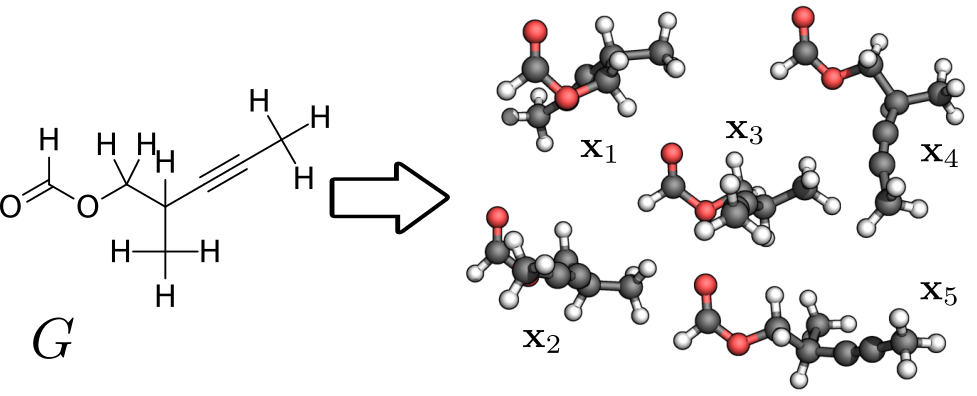

# GraphDG - A Deep Generative Model for Molecular Distance Geometry based on Graph Neural Networks



**A Generative Model for Molecular Distance Geometry**<br>
Gregor N. C. Simm, José Miguel Hernández-Lobato <br>
*Proceedings of the 37th International Conference on Machine Learning*, Vienna, Austria, PMLR 108, 2020.<br>
https://arxiv.org/abs/1909.11459

## Installation

1. Create new Python 3.7 environment and activate:
   ```text
   virtualenv --python=python3.7 graphdg-venv
   source graphdg-venv/bin/activate
   ```

2. Install required packages and library itself:
   ```text
   pip install -r graphdg/requirements.txt
   pip install -e graphdg/
   ```

3. Install [RDKit (2020.03.1)](https://www.rdkit.org/docs/Install.html).

## Usage

1. Download and unpack ISO17 dataset
   ```text
   wget http://quantum-machine.org/datasets/iso17.tar.gz
   tar -xf iso17.tar.gz 
   ```

2. Prepare dataset
   ```text
   python3 graphdg/scripts/parse.py --path=iso17
   ```

3. Train model and generate conformations
   ```text
   python3 graphdg/scripts/run.py --train_path=iso17_split-0_train.pkl --test_path=iso17_split-0_test.pkl
   ```

## Reference

```text

```

